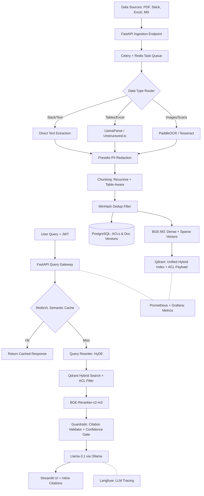

# AskTheCompany: Enterprise RAG over Multimodal Dirty Data
> 🔓 **100% Open-Source** production-grade RAG pipeline handling scanned PDFs, Excel tables, Slack threads, and Confluence docs — with role-based access control (ACL), PII redaction, semantic caching, and full observability. **Zero paid APIs. Zero vendor lock-in.**

[](https://opensource.org/licenses/MIT)
[](https://www.python.org/downloads/release/python-3110/)
[](https://www.docker.com/)
[](#-tech-stack--100-open-source)

---

## 🎥 Demo
* **Live App URL:** Local Deployment Only (`http://localhost:8501`)
* **Loom Walkthrough:** Video coming soon

---

## 📋 Problem Statement
"BigCorp" has 15 years of internal knowledge scattered across Confluence pages, scanned PDF manuals, Slack export threads, and financial Excel tables. Standard off-the-shelf RAG systems fail to query this data because:
1. Documents contain complex tables and images requiring OCR.
2. Multiple versions of the same file exist across different communication channels.
3. Knowledge is permissioned; an employee in Marketing should not be able to retrieve search results containing salary structures from HR documents.

**AskTheCompany** solves this by building a parsing pipeline that extracts clean layouts, redacts PII, filters duplicates using MinHash, indexes data into a unified hybrid vector index, and enforces strict Access Control Lists (ACLs) at the database level before generating answers with inline citations — all using a 100% open-source stack.

---

## 🏗️ Architecture
The platform is split into an **Async Batch Ingestion Pipeline** and a **Low-Latency Serving API**, connected by a Celery task queue:



---

## 🛠️ Tech Stack — 100% Open Source

Every component is open source and free to self-host. The system can be deployed entirely on-premise behind a corporate firewall with no data ever leaving the network.

| Component | Technology | License | Justification |
| :--- | :--- | :--- | :--- |
| **Embedding** | `BGE-M3` (BAAI) | MIT | Unified dense (1024-dim) + sparse vectors in a single pass. Eliminates separate BM25. |
| **LLM** | `Llama-3.1-8B` via `Ollama` | Llama 3.1 Community | Runs 100% locally. Zero API cost. Excellent citation compliance. |
| **Vector DB** | `Qdrant` | Apache 2.0 | Native hybrid dense+sparse search. Payload filtering for ACLs. |
| **Metadata DB** | `PostgreSQL` | PostgreSQL License | User-Role ACL mappings, doc versioning, audit logs. |
| **Object Store** | `MinIO` | AGPLv3 | S3-compatible local storage for raw source files. |
| **OCR** | `PaddleOCR` / `Tesseract` | Apache 2.0 | Layout-aware OCR for scanned PDFs. |
| **Table Parsing** | `Unstructured.io` / `LlamaParse` (free) | Apache 2.0 / Freemium | Structured table extraction to Markdown. |
| **Task Queue** | `Celery` + `Redis` | BSD | Async ingestion decoupled from query path. |
| **PII Redaction** | `Microsoft Presidio` | MIT | Masks 30+ PII entity types before embedding/LLM. |
| **Re-ranking** | `BGE-Reranker-v2-m3` | MIT | Local cross-encoder reranking on CPU. |
| **Semantic Cache** | `RedisVL` | MIT | Caches similar queries; ~50ms vs ~5s response. |
| **Orchestration** | `LlamaIndex` | MIT | Index structures, query routing, multi-doc retrieval. |
| **API** | `FastAPI` | MIT | Async API with OpenAPI docs, JWT auth. |
| **Observability** | `Langfuse` + `Prometheus`/`Grafana` | MIT / Apache 2.0 | LLM tracing + system metrics dashboards. |
| **UI** | `Streamlit` | Apache 2.0 | Multi-tab: Search, Source Lineage, Admin. |
| **Evaluation** | `RAGAS` | Apache 2.0 | Faithfulness, Context Recall, Answer Relevancy. |
| **Deployment** | `Docker` + `Docker Compose` | Apache 2.0 | Single-command deployment. K8s-ready. |

---

## 🚀 Quickstart

### Prerequisites
* Python 3.11+
* Docker & Docker Compose
* ~8GB RAM (for Ollama + BGE-M3)

### 1. Installation
```bash
git clone https://github.com/yourusername/ask-the-company.git
cd ask-the-company
python -m venv venv
source venv/bin/activate  # On Windows: .\venv\Scripts\activate
pip install -r requirements.txt
```

### 2. Environment Setup
Create a `.env` file in the root directory:
```env
QDRANT_HOST=localhost
QDRANT_PORT=6333
POSTGRES_USER=askthecompany
POSTGRES_PASSWORD=your_secure_password
POSTGRES_DB=askthecompany
REDIS_URL=redis://localhost:6379
MINIO_ROOT_USER=minioadmin
MINIO_ROOT_PASSWORD=minioadmin
OLLAMA_HOST=http://localhost:11434
LANGFUSE_HOST=http://localhost:3000
```

### 3. Launch All Services
```bash
docker-compose up -d
```
This starts: Qdrant, PostgreSQL, Redis, MinIO, Ollama, Langfuse, Prometheus, and Grafana.

### 4. Pull the LLM & Embedding Models
```bash
docker exec -it ollama ollama pull llama3.1:8b
# BGE-M3 is loaded automatically by the application via HuggingFace
```

### 5. Run Ingestion Pipeline
```bash
python src/ingestion.py --data_dir ./data/seed
```

### 6. Launch the Web Application
```bash
streamlit run src/app.py
```

### 7. Running Tests
```bash
pytest tests/
```

---

## 📊 Data Specifications
The ingestion pipeline processes 4 source types:
* **Confluence:** Ingested via markdown files; maintains heading-level structural hierarchies.
* **Scanned PDFs:** Run through PaddleOCR to extract text blocks with layout awareness.
* **Slack Exports:** JSON files parsed to reconstruct conversational threads.
* **Excel Sheets:** Converted into Markdown tables so tabular structures are preserved in LLM context windows.

For data schemas, licenses, and privacy practices, see [/docs/data.md](file:///c:/Users/konal/RAG-Futurense/docs/data.md).

---

## 🛡️ Security Features
* **PII Redaction:** Microsoft Presidio masks sensitive entities (SSN, credit cards, emails) before any data is embedded or sent to the LLM.
* **DB-Level ACL Enforcement:** Restricted chunks never enter the retrieval results — the LLM never sees them.
* **JWT Authentication:** All API endpoints are protected with JWT tokens validated against PostgreSQL user-role mappings.
* **Zero External API Calls:** All models (embedding, reranking, LLM) run locally. No data leaves the network.

---

## 📄 Architecture & Design Documents
We document our design trade-offs and technical decisions:
* [Architecture & Tech Stack](docs/architecture_tech_stack.md)
* [Design Document](docs/design_doc.md)

---

## ⚠️ Known Limitations
* **OCR Latency:** OCR parsing for large scanned PDFs (>50 pages) is slow; mitigated by async Celery workers.
* **LLM Memory:** Running Llama-3.1-8B via Ollama requires ~6GB VRAM or ~8GB RAM (CPU mode).
* **Guardrail Refusal Rate:** The confidence gate refuses ~5-10% of queries. This is an intentional trade-off for enterprise reliability.

---

## 🗺️ Roadmap
* **Kubernetes Deployment:** Helm charts for horizontal scaling of Celery workers and API pods.
* **Layout-Aware Visual Chunking:** Leverage multimodal LLMs for parsing visual components directly.
* **Feedback Loop:** Thumbs up/down on answers to create a human-in-the-loop training dataset.
* **Multi-Tenant Support:** Isolated vector namespaces per organization.

---

## ⚖️ License
Distributed under the MIT License. See `LICENSE` for more information.

## 🤝 Acknowledgements
* [LlamaIndex Documentation](https://docs.llamaindex.ai/)
* [RAGAS Evaluation Framework](https://docs.ragas.io/)
* [BAAI BGE-M3](https://huggingface.co/BAAI/bge-m3)
* [Ollama](https://ollama.ai/)
* [Microsoft Presidio](https://github.com/microsoft/presidio)
