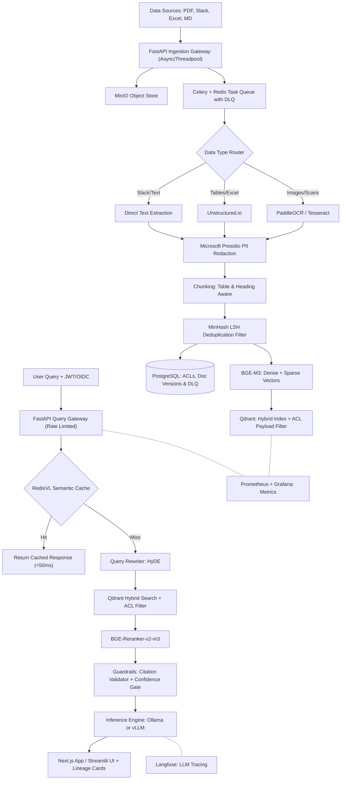

# AskTheCompany (Enterprise Edition): Zero-Trust RAG Platform
> 🔓 **100% Open-Source, Kubernetes-Native** distributed semantic search engine designed for Fortune 500 companies in highly regulated sectors (finance, healthcare, defense). Features payload-level Access Control Lists (ACLs), automated Presidio PII redaction, MinHash LSH deduplication, dual-encoder hybrid search, cross-encoder reranking, Celery Dead Letter Queues (DLQ), and OIDC/SAML enterprise identity. **Zero cloud data exfiltration. Zero vendor lock-in.**

[](https://opensource.org/licenses/MIT)
[](https://www.python.org/downloads/release/python-3120/)
[](https://fastapi.tiangolo.com/)
[](https://nextjs.org/)
[](https://www.docker.com/)
[](.github/workflows/ci.yml)

---

## 🎥 Access Interfaces
* **Next.js Production Web App:** `http://localhost:3000` (Modern Dark Glassmorphism UI, ACL inspection, DLQ manager)
* **Streamlit Admin/Testing Console:** `http://localhost:8501` (Legacy interactive demo)
* **FastAPI Swagger / OpenAPI Docs:** `http://localhost:8000/docs`
* **Prometheus Metrics:** `http://localhost:9090`
* **Grafana Dashboards:** `http://localhost:3001`
* **MinIO Console:** `http://localhost:9001`

---

## 📋 The Enterprise Architecture
Generative AI is revolutionizing productivity, but highly regulated enterprises are locked out. They cannot legally or safely send their proprietary, classified, or PII-laden data to external API endpoints. Standard off-the-shelf open-source RAG systems fail to bridge this gap because:
1. They ignore document-level permissions, creating massive insider-threat vulnerabilities (e.g., junior employees querying executive compensation).
2. They cannot handle complex, dirty enterprise data lakes (scanned PDFs, multi-version Slack exports, massive Excel tables).
3. They lack multi-tenant vector isolation, dead-letter queues, and scalable GPU inference orchestration.

**AskTheCompany** solves this by building a secure, high-throughput AI infrastructure stack from the ground up:


```mermaid
graph TD
    A["Data Sources: PDF, Slack, Excel, MD"] --> B["FastAPI Ingestion Gateway (Async/Threadpool)"]
    B --> S3["MinIO Object Store"]
    B --> C["Celery + Redis Task Queue with DLQ"]
    
    C --> D{"Data Type Router"}
    D -->|Images/Scans| E["PaddleOCR / Tesseract"]
    D -->|Tables/Excel| F["Unstructured.io"]
    D -->|Slack/Text| G["Direct Text Extraction"]
    
    E & F & G --> H["Microsoft Presidio PII Redaction"]
    H --> I["Chunking: Table & Heading Aware"]
    I --> J["MinHash LSH Deduplication Filter"]
    
    J --> K["BGE-M3: Dense + Sparse Vectors"]
    K --> L["Qdrant: Hybrid Index + ACL Payload Filter"]
    J --> M[("PostgreSQL: ACLs, Doc Versions & DLQ")]
    
    N["User Query + JWT/OIDC"] --> O["FastAPI Query Gateway (Rate Limited)"]
    O --> P{"RedisVL Semantic Cache"}
    P -->|Hit| Q["Return Cached Response (<50ms)"]
    P -->|Miss| R["Query Rewriter: HyDE"]
    R --> S["Qdrant Hybrid Search + ACL Filter"]
    S --> T["BGE-Reranker-v2-m3"]
    T --> U["Guardrails: Citation Validator + Confidence Gate"]
    U --> V["Inference Engine: Ollama or vLLM"]
    V --> W["Next.js App / Streamlit UI + Lineage Cards"]
    
    V -.- X["Langfuse: LLM Tracing"]
    L & O -.- Y["Prometheus + Grafana: Metrics"]

```

---

## 🛠️ Enterprise Features (v2.0 Overhaul)

### 1. Zero-Trust Access Control Lists (ACLs)
* Document permissions (`Public`, `HR`, `Management`, `Engineering`) are indexed directly into the Qdrant vector payload.
* The query gateway strictly translates authenticated user roles into vector-level filters. The LLM **physically cannot retrieve or perceive** unauthorized information.

### 2. Enterprise Identity (IAM & OIDC)
* Supports dual-mode authentication via `AUTH_MODE=local` (built-in JWT) or `AUTH_MODE=oidc` (Enterprise Single Sign-On with Keycloak, Okta, or Azure AD).
* Automatically validates tokens against the Identity Provider's JWKS endpoint and extracts user role claims.

### 3. Asynchronous Non-Blocking Backend
* All synchronous I/O operations (file reading, MinIO uploads, Celery dispatches) are executed in a managed thread pool via `run_in_threadpool`, keeping the ASGI event loop completely free for concurrent search queries.
* Rate-limited `/query` endpoint protected by `slowapi`.

### 4. Dead Letter Queue (DLQ) & Fault Tolerance
* Celery ingestion workers feature exponential backoff retry policies (`autoretry_for=(Exception,)`, `max_retries=3`).
* Exhausted tasks are persisted into the `failed_ingestions` PostgreSQL table and exposed via `GET /admin/dlq` with 1-click retry functionality (`POST /admin/dlq/{id}/retry`).

### 5. High-Throughput Inference (Ollama & vLLM)
* Switchable inference backend via `INFERENCE_BACKEND=ollama` or `INFERENCE_BACKEND=vllm`.
* vLLM client uses OpenAI-compatible `/v1/chat/completions` protocol for multi-GPU continuous batching and PagedAttention in production clusters.

### 6. Modern Next.js Production Web Application
* Fully responsive, dark-mode Glassmorphism user interface built with Next.js 14 App Router, TypeScript, and Tailwind CSS.
* Features real-time source lineage cards, verified citation drawers, semantic cache badges, demo role switchers, and an enterprise admin console.

---

## 🚀 Quickstart & Deployment

### 1. Launch All Services (Docker Compose)
```bash
# Clone the repository
git clone https://github.com/ManoharKonala/AskTheCompnay.git
cd AskTheCompnay

# Copy environment template
cp .env.example .env

# Launch the entire enterprise stack
docker-compose up -d
```

### 2. Pull the LLM Weights
```bash
docker exec -it $(docker ps -qf "name=ollama") ollama pull llama3.1:8b
```

### 3. Launch Next.js Frontend
```bash
cd frontend
npm install
npm run dev
# Open http://localhost:3000 in your browser
```

---

## 🧪 Testing & CI/CD
The project is covered by automated pytest integration suites and a GitHub Actions workflow:
```bash
pytest tests/ -v
```

CI workflow (`.github/workflows/ci.yml`) automatically executes:
1. **Linting & Code Quality:** `ruff` checks across `src/` and `tests/`.
2. **Integration Tests:** Pytest running against PostgreSQL and Redis service containers.
3. **Docker Build:** Verification of multi-stage Docker build layers.

---

## ⚖️ License
Distributed under the MIT License. See `LICENSE` for more information.
