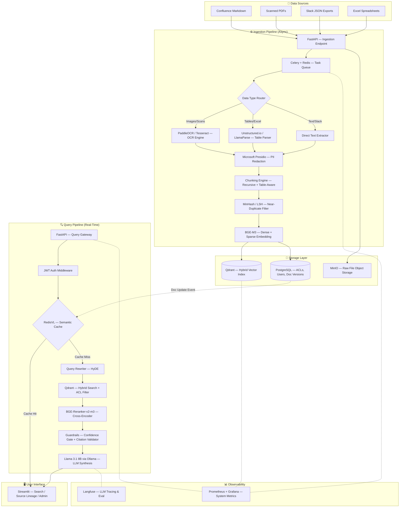
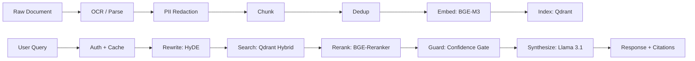
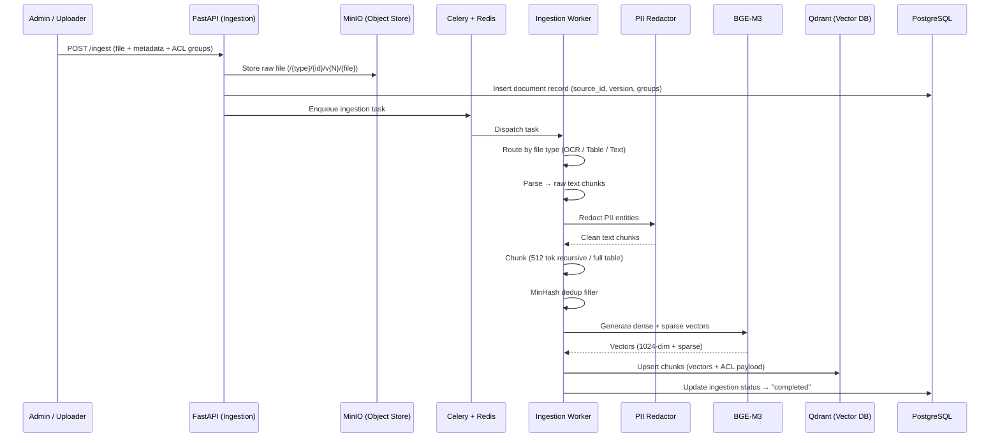
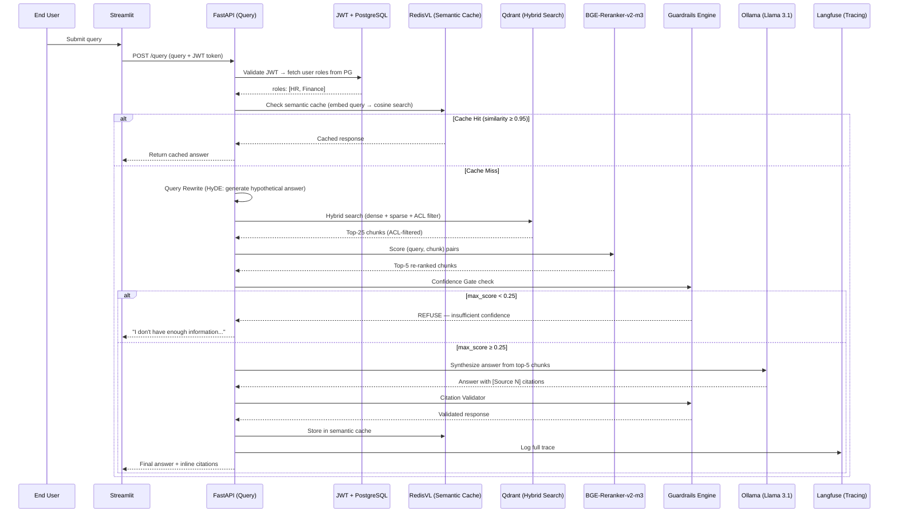
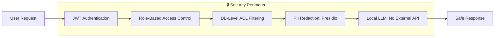
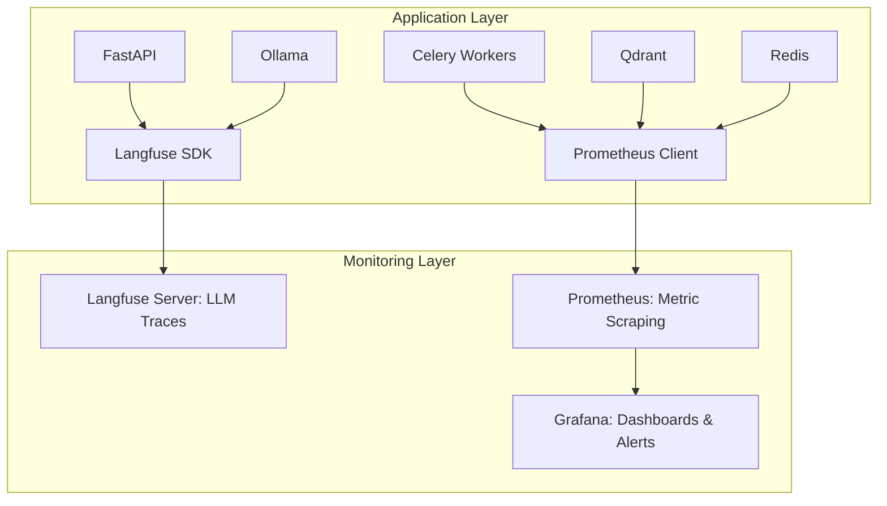
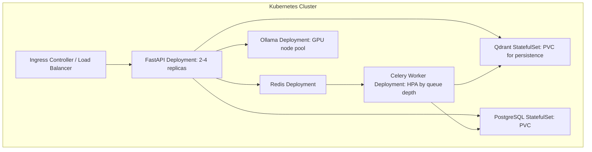

# AskTheCompany — Architecture & Tech Stack Reference

> **Version:** 1.0 — Final Architecture Sign-Off  
> **Last Updated:** 29 June 2026  
> **Problem Code:** E3 · LLM Systems & Applied GenAI  
> **Stack Philosophy:** 🔓 100% Open Source · Zero Paid APIs · Full On-Premise Capability

---

## Table of Contents

1. [System Overview](#1-system-overview)
2. [Architecture Diagrams](#2-architecture-diagrams)
3. [Component Deep Dive](#3-component-deep-dive)
4. [Tech Stack Summary Table](#4-tech-stack-summary-table)
5. [Data Flow: Ingestion Pipeline](#5-data-flow-ingestion-pipeline)
6. [Data Flow: Query Pipeline](#6-data-flow-query-pipeline)
7. [Security Architecture](#7-security-architecture)
8. [Observability Architecture](#8-observability-architecture)
9. [Deployment Architecture](#9-deployment-architecture)
10. [Design Decision Log](#10-design-decision-log)

---

## 1. System Overview

AskTheCompany is architected as **two decoupled subsystems** connected by a message queue:

| Subsystem | Responsibility | Latency Profile |
|:---|:---|:---|
| **Ingestion Pipeline** | Parse, redact, deduplicate, embed, and index documents | Batch / Async (seconds–minutes per document) |
| **Query API** | Authenticate, cache-check, retrieve, rerank, guard, synthesize | Real-time (< 5s cold, < 200ms cached) |

This separation ensures that uploading a 200-page scanned PDF **never** blocks a user searching for "Q3 revenue targets."

---

## 2. Architecture Diagrams

### 2.1 Full System Architecture (C4 Level 2 — Container Diagram)



### 2.2 Simplified Data Flow (Linear View)



---

## 3. Component Deep Dive

### 3.1 Embedding Model — BGE-M3

| Property | Value |
|:---|:---|
| **Model** | `BAAI/bge-m3` |
| **License** | MIT |
| **Dense Dimensions** | 1024 |
| **Sparse Output** | SPLADE-like lexical weights |
| **Max Tokens** | 8192 |
| **Memory** | ~2 GB RAM |
| **Languages** | 100+ (multilingual) |

**Why BGE-M3?** It produces **both** dense semantic vectors and sparse lexical-weight vectors in a **single forward pass**. This eliminates the need for a separate BM25 index (like `rank-bm25`) which would be in-memory, non-persistent, and a scalability bottleneck. Both vector types are stored natively in Qdrant and queried together via Reciprocal Rank Fusion (RRF).

---

### 3.2 LLM — Llama 3.1 8B Instruct via Ollama

| Property | Value |
|:---|:---|
| **Model** | `meta-llama/Llama-3.1-8B-Instruct` |
| **License** | Llama 3.1 Community License |
| **Runner** | Ollama (local inference server) |
| **VRAM Required** | ~6 GB (GPU) or ~8 GB (CPU mode) |
| **Context Window** | 128K tokens |
| **API Cost** | $0 — runs entirely locally |

**Why Ollama + Llama 3.1?**
- **Zero data leakage** — no document content or queries leave the network.
- **Zero API cost** — no per-token billing.
- **Zero vendor lock-in** — swap to Mistral, Gemma, or Qwen with a single config change.
- 128K context window is large enough for multi-chunk synthesis with full table inclusion.

**Fallback Chain:**
```
Primary:   Ollama → Llama-3.1-8B-Instruct   (always available)
Fallback:  Ollama → Llama-3.1-70B-Instruct   (if GPU ≥ 48GB available)
Optional:  OpenAI → GPT-4o-mini               (user opt-in only, not default)
```

---

### 3.3 Vector Database — Qdrant

| Property | Value |
|:---|:---|
| **Version** | Latest stable |
| **License** | Apache 2.0 |
| **Search Type** | Hybrid: Dense (HNSW) + Sparse (inverted index) |
| **Fusion** | Reciprocal Rank Fusion (RRF) |
| **ACL Filtering** | Payload-based `must` filter on `allowed_groups` field |
| **Persistence** | Disk-backed (survives restarts) |
| **API** | REST + gRPC |

**Why Qdrant over Pinecone/Weaviate/Chroma?**
- **Native hybrid search** — no external BM25 needed.
- **Payload filtering at query time** — ACLs enforced at the DB level, not post-retrieval.
- **Self-hostable** — runs in Docker, no cloud dependency.
- **Performance** — HNSW with quantization handles millions of vectors on a single node.

**Collection Schema:**
```json
{
  "collection_name": "askthecompany",
  "vectors": {
    "dense": { "size": 1024, "distance": "Cosine" },
    "sparse": { "type": "sparse" }
  },
  "payload_schema": {
    "source_id":       "keyword",
    "source_type":     "keyword",
    "allowed_groups":  "keyword[]",
    "is_active":       "bool",
    "doc_version":     "integer",
    "chunk_text":      "text",
    "created_at":      "datetime"
  }
}
```

---

### 3.4 Re-Ranking — BGE-Reranker-v2-m3

| Property | Value |
|:---|:---|
| **Model** | `BAAI/bge-reranker-v2-m3` |
| **License** | MIT |
| **Type** | Cross-encoder (query + passage scored jointly) |
| **Runs On** | CPU (no GPU required) |
| **Latency** | ~50–100ms for top-25 passages |
| **Memory** | ~1.5 GB RAM |

**How it's used:** After Qdrant returns the top-25 hybrid search results, the reranker scores each `(query, chunk)` pair with a cross-encoder and re-orders them by relevance. Only the top-5 highest-scoring chunks are passed to the LLM for synthesis. This dramatically reduces noise in the LLM's context window.

---

### 3.5 Chunking Strategy

| Data Type | Method | Chunk Size | Overlap | Rationale |
|:---|:---|:---|:---|:---|
| Prose (Confluence, Slack) | `RecursiveCharacterTextSplitter` | 512 tokens | 64 tokens (12.5%) | Sweet spot for BGE-M3 embedding quality |
| Tables (Excel, PDF tables) | Full table as single chunk (Markdown) | Variable | None | Splitting tables loses header-row context |
| Mixed (PDF with text + tables) | Hybrid: parse tables separately, chunk remaining prose | 512 / Variable | 64 / None | LlamaParse extracts tables; rest is recursive |

**Why 512 tokens?** BGE-M3's embedding quality peaks at 256–512 tokens. Larger chunks dilute relevance; smaller chunks lose coherence. The 12.5% overlap ensures sentences at chunk boundaries are not lost.

---

### 3.6 PII Redaction — Microsoft Presidio

| Property | Value |
|:---|:---|
| **License** | MIT |
| **Entities Detected** | 30+ (SSN, credit cards, emails, phone numbers, names, addresses, etc.) |
| **Customizable** | Yes — add domain-specific entities (employee IDs, internal project codes) |
| **Position in Pipeline** | **After** parsing, **before** embedding and LLM |

**Why?** Sending raw enterprise documents to *any* model (even local) without PII stripping is a compliance risk. Presidio runs in-process, adds <50ms per chunk, and is fully customizable for domain-specific entities.

---

### 3.7 Semantic Cache — RedisVL

| Property | Value |
|:---|:---|
| **License** | MIT |
| **Backend** | Redis with vector similarity search |
| **Cache Key** | Embedding of the user query |
| **Similarity Threshold** | Cosine similarity ≥ 0.95 → cache hit |
| **TTL** | 24 hours (default) |
| **Invalidation** | Source-ID based eviction on document re-ingestion |

**Performance Impact:**
| Metric | Cold (Cache Miss) | Warm (Cache Hit) |
|:---|:---|:---|
| Latency | ~3–5 seconds | ~50 milliseconds |
| LLM Tokens Used | ~2000 | 0 |
| Cost | Compute + RAM | Negligible |

---

### 3.8 Guardrails Engine

Two layers of protection between retrieval and the user:

**Layer 1 — Confidence Gate (Pre-Synthesis):**
```
IF max_rerank_score < 0.25:
    RETURN "I don't have enough information to answer this confidently."
    DO NOT call the LLM.
```
This prevents the LLM from being forced to synthesize an answer from irrelevant context.

**Layer 2 — Citation Validator (Post-Synthesis):**
```
FOR each [Source N] in LLM response:
    VERIFY that Source N maps to a real retrieved chunk ID
    IF unmapped → strip the citation
IF >50% of citations invalid:
    FLAG response for human review
```

---

### 3.9 Task Queue — Celery + Redis

| Property | Value |
|:---|:---|
| **Broker** | Redis |
| **Backend** | Redis |
| **License** | BSD |
| **Workers** | Configurable (default: 4 concurrent) |
| **Retry Policy** | 3 retries with exponential backoff |

**Task Types:**
| Task | Priority | Avg. Duration |
|:---|:---|:---|
| `ingest_pdf_ocr` | Low | 30–120s (depends on page count) |
| `ingest_excel` | Medium | 5–15s |
| `ingest_slack_json` | Medium | 2–5s |
| `ingest_markdown` | High | 1–3s |
| `reindex_document` | Low | 10–60s |

---

### 3.10 Metadata & ACL Store — PostgreSQL

| Table | Purpose |
|:---|:---|
| `users` | User ID, email, hashed password |
| `roles` | Role definitions (HR, Finance, Engineering, etc.) |
| `user_roles` | Many-to-many mapping of users to roles |
| `documents` | Document metadata, source_id, current version, source_type |
| `document_versions` | Version history with MinIO object paths |
| `ingestion_logs` | Audit trail: who uploaded what, when, parsing status |

---

### 3.11 Object Storage — MinIO

| Property | Value |
|:---|:---|
| **License** | AGPLv3 |
| **API** | S3-compatible |
| **Purpose** | Store raw source files (PDFs, Excel, Slack JSON) |
| **Path Convention** | `/{source_type}/{doc_id}/v{N}/{filename}` |

Raw files are stored separately from their vector representations. This enables re-processing with improved parsers without re-uploading, and provides an audit trail of original documents.

---

### 3.12 Observability Stack

#### Langfuse (LLM-Specific Tracing)
| What It Tracks | Why |
|:---|:---|
| Full prompt sent to LLM | Debug hallucinations |
| Retrieved chunk IDs + scores | Verify retrieval quality |
| Reranker scores per chunk | Identify reranking failures |
| Token usage per request | Cost monitoring |
| Latency per pipeline stage | Bottleneck identification |
| User feedback (thumbs up/down) | Quality improvement loop |

#### Prometheus + Grafana (System Metrics)
| Metric | Alert Threshold |
|:---|:---|
| API P95 latency | > 8 seconds |
| Celery queue depth | > 100 pending tasks |
| Qdrant memory usage | > 80% allocated RAM |
| Ollama inference latency | > 10 seconds per request |
| Redis cache hit rate | < 20% (review cache config) |
| Failed ingestion tasks | > 5% error rate |

---

## 4. Tech Stack Summary Table

| # | Layer | Component | Technology | License | Cost |
|:---|:---|:---|:---|:---|:---|
| 1 | Embedding | Dense + Sparse Vectors | `BGE-M3` | MIT | **Free** |
| 2 | LLM | Text Synthesis | `Llama 3.1 8B` + `Ollama` | Community / MIT | **Free** |
| 3 | Vector DB | Hybrid Search + ACL | `Qdrant` | Apache 2.0 | **Free** |
| 4 | Relational DB | ACLs, Users, Versions | `PostgreSQL` | PostgreSQL | **Free** |
| 5 | Object Storage | Raw Files | `MinIO` | AGPLv3 | **Free** |
| 6 | OCR | Scanned PDF Text Extraction | `PaddleOCR` / `Tesseract` | Apache 2.0 | **Free** |
| 7 | Table Parser | Structured Table Extraction | `Unstructured.io` | Apache 2.0 | **Free** |
| 8 | Task Queue | Async Job Processing | `Celery` + `Redis` | BSD | **Free** |
| 9 | PII Redaction | Privacy Compliance | `Microsoft Presidio` | MIT | **Free** |
| 10 | Re-Ranking | Cross-Encoder Precision | `BGE-Reranker-v2-m3` | MIT | **Free** |
| 11 | Semantic Cache | Query-Level Caching | `RedisVL` | MIT | **Free** |
| 12 | Orchestration | Pipeline Framework | `LlamaIndex` | MIT | **Free** |
| 13 | API Layer | REST Gateway | `FastAPI` | MIT | **Free** |
| 14 | LLM Observability | Tracing & Eval | `Langfuse` | MIT | **Free** |
| 15 | System Metrics | Dashboards & Alerts | `Prometheus` + `Grafana` | Apache 2.0 | **Free** |
| 16 | Frontend | User Interface | `Streamlit` | Apache 2.0 | **Free** |
| 17 | Evaluation | RAG Quality Metrics | `RAGAS` | Apache 2.0 | **Free** |
| 18 | Containerisation | Deployment | `Docker` + `Docker Compose` | Apache 2.0 | **Free** |
| | | | | **Total Monthly Cost** | **$0** |

---

## 5. Data Flow: Ingestion Pipeline



---

## 6. Data Flow: Query Pipeline



---

## 7. Security Architecture



| Layer | Mechanism | Threat Mitigated |
|:---|:---|:---|
| **Authentication** | JWT tokens validated per request | Unauthorized access |
| **Authorization** | PostgreSQL role lookup → Qdrant payload filter | Cross-department data leakage |
| **PII Redaction** | Presidio masks entities before embedding | Compliance violations (GDPR/HIPAA) |
| **Local Inference** | Ollama runs on-premise | Data exfiltration to third-party APIs |
| **Audit Logging** | PostgreSQL ingestion logs + Langfuse traces | Forensic investigation & compliance |

---

## 8. Observability Architecture



**Two complementary systems:**
- **Langfuse** answers: *"Why did the AI give a bad answer?"* (trace the retrieval → rerank → prompt → response chain)
- **Prometheus + Grafana** answers: *"Why is the system slow/down?"* (queue depth, memory, latency, error rates)

---

## 9. Deployment Architecture

### Current Phase: Docker Compose

```yaml
# docker-compose.yml (simplified)
services:
  qdrant:        # Vector DB         — port 6333
  postgres:      # Metadata DB       — port 5432
  redis:         # Queue Broker      — port 6379
  minio:         # Object Storage    — port 9000
  ollama:        # Local LLM Server  — port 11434
  fastapi:       # API Gateway       — port 8000
  celery-worker: # Async Workers     — no exposed port
  streamlit:     # Frontend UI       — port 8501
  langfuse:      # LLM Tracing       — port 3000
  prometheus:    # Metrics Scraper   — port 9090
  grafana:       # Dashboards        — port 3001
```

### Future Phase: Kubernetes (Roadmap)



No code changes required — only Helm chart configuration and `PersistentVolumeClaim` definitions.

---

## 10. Design Decision Log

| # | Decision | Choice | Alternative Considered | Why Rejected |
|:---|:---|:---|:---|:---|
| 1 | Embedding model | BGE-M3 (unified dense+sparse) | OpenAI `text-embedding-3-small` + `rank-bm25` | Paid API; two separate indexes; BM25 is in-memory only |
| 2 | LLM | Llama 3.1 8B via Ollama | GPT-4o-mini (OpenAI API) | Paid; data leaves network; vendor lock-in |
| 3 | Vector DB | Qdrant | Pinecone, Chroma, Weaviate | Pinecone is paid; Chroma lacks hybrid search; Weaviate has higher resource overhead |
| 4 | Reranker | BGE-Reranker-v2-m3 | Cohere Rerank API | Paid API; adds external dependency |
| 5 | Search strategy | Qdrant native hybrid (RRF) | Separate BM25 + vector merge | `rank-bm25` is in-memory, non-persistent, single-process bottleneck |
| 6 | ACL enforcement | DB-level payload filter | Post-retrieval application filter | Post-retrieval leaks restricted chunks into LLM context window |
| 7 | PII handling | Presidio pre-embedding | No redaction / post-hoc | Compliance risk; once embedded, PII is irrecoverable |
| 8 | Task queue | Celery + Redis | Direct synchronous processing | OCR blocks the API thread; unacceptable for concurrent users |
| 9 | Caching | RedisVL semantic cache | No cache / exact-match cache | Exact-match misses semantically identical queries |
| 10 | Deployment (current) | Docker Compose | Kubernetes | Over-engineering for development phase; K8s is roadmap |
| 11 | Object storage | MinIO | Local filesystem | Filesystem doesn't version; no S3 API compatibility; not portable |
| 12 | Observability | Langfuse + Prometheus/Grafana | Basic Python logging | Logs can't trace LLM prompt chains or visualize system health |

---

> **This document serves as the single source of truth for the AskTheCompany architecture. All ADRs in `/docs/adr/` expand on individual decisions listed in Section 10.**
