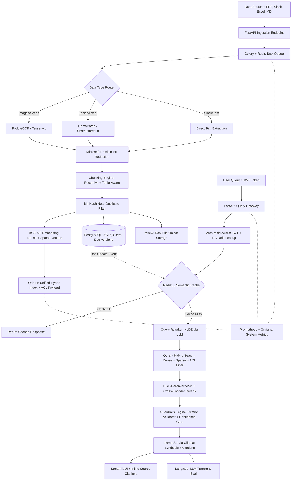

# Final Design Doc: AskTheCompany — Enterprise RAG over Multimodal Dirty Data
**Problem Code:** E3  
**Segment:** LLM Systems & Applied GenAI  
**Author:** Manohar Konala  
**Target Roles:** LLM Engineer, AI Product Engineer, GenAI Infrastructure Engineer  

> **🔓 100% Open-Source Stack — Zero Vendor Lock-In.**  
> Every component in this architecture is open source and free to self-host.  
> No paid APIs. No cloud lock-in. Full on-premise deployment capability.

---

## 1. Project Goal & Business Value
"AskTheCompany" is an enterprise-grade Retrieval-Augmented Generation (RAG) platform designed to search across heterogeneous, unstructured, and permissioned data sources (Confluence markdown, scanned PDFs, Slack JSON threads, and Excel sheets). It resolves the three primary failures of off-the-shelf RAG:
1. **Multimodal/Tabular Data:** Extracting and parsing tables and OCR text accurately.
2. **Knowledge Drift & Duplication:** Deduplicating files containing minor differences via MinHash/LSH.
3. **Security & Privacy:** Restricting search results dynamically using document Access Control Lists (ACLs) and redacting PII before it reaches the LLM.

---

## 2. High-Level Architecture & Data Flow



---

## 3. Tech Stack — 100% Open Source & Free

Every single component below can be self-hosted at zero cost. This is a deliberate architectural choice: the system can be deployed entirely on-premise behind a corporate firewall with no data ever leaving the network.

| Component | Choice | License | Justification |
| :--- | :--- | :--- | :--- |
| **Embedding Model** | `BGE-M3` (BAAI) | MIT | Produces **both** dense (1024-dim) and sparse (SPLADE-like) vectors in a single forward pass. Eliminates the need for a separate BM25 engine. Multilingual. |
| **LLM (Synthesis)** | `Llama-3.1-8B-Instruct` via `Ollama` | Llama 3.1 Community | Runs 100% locally. Excellent instruction-following and citation compliance. Zero API cost. |
| **Vector DB** | `Qdrant` | Apache 2.0 | Native hybrid dense+sparse search in a single query. Built-in payload filtering for ACLs. Disk-persistent. |
| **Metadata DB** | `PostgreSQL` | PostgreSQL License | Rock-solid relational store for User-Role ACL mappings, document version tracking, and audit logs. |
| **Object Storage** | `MinIO` | AGPLv3 | S3-compatible local object storage for raw source files (PDFs, Excel, Slack JSON). |
| **Parsing & OCR** | `PaddleOCR` / `Tesseract` | Apache 2.0 / Apache 2.0 | PaddleOCR for high-accuracy layout-aware OCR; Tesseract as a lightweight fallback. |
| **Table Parsing** | `LlamaParse` (free tier) or `Unstructured.io` | Freemium / Apache 2.0 | LlamaParse free tier (1000 pages/day) for prototyping; Unstructured.io as a fully open-source fallback for production. |
| **Task Queue** | `Celery` + `Redis` | BSD / BSD | Decouples heavy OCR/embedding tasks from the synchronous query path. |
| **PII Redaction** | `Microsoft Presidio` | MIT | Detects & masks 30+ PII entity types (SSN, credit cards, emails, names) before data reaches the embedding model or LLM. |
| **Re-ranking** | `BGE-Reranker-v2-m3` (BAAI) | MIT | Open-source cross-encoder. Runs locally on CPU. Dramatically improves retrieval precision on the top-k chunks. |
| **Semantic Cache** | `RedisVL` | MIT | Caches semantically similar queries. Cuts repeated query latency from ~5s to ~50ms. |
| **Orchestration** | `LlamaIndex` | MIT | Mature framework for index structures, query routing, and multi-document retrieval. |
| **API Gateway** | `FastAPI` | MIT | High-performance async Python API with automatic OpenAPI docs. |
| **Observability** | `Langfuse` (self-hosted) | MIT | Full LLM tracing: prompt → retrieval → rerank → synthesis. Per-request cost & latency tracking. |
| **System Metrics** | `Prometheus` + `Grafana` | Apache 2.0 | Dashboards for queue depth, Qdrant memory, API latency, and worker health. |
| **UI** | `Streamlit` | Apache 2.0 | Rapid development of a multi-tab interface: Search, Source Lineage, Admin Dashboard. |
| **Containerisation** | `Docker` + `Docker Compose` | Apache 2.0 | Single-command deployment. Kubernetes-ready architecture for future horizontal scaling. |
| **Evaluation** | `RAGAS` | Apache 2.0 | Automated metrics: Faithfulness, Context Recall, Context Precision, Answer Relevancy. |

---

## 4. Key Design Decisions

### A. Embedding Strategy: BGE-M3 Unified Dense + Sparse

**Context:** Most RAG tutorials use a dense-only embedding model (e.g., OpenAI `text-embedding-ada-002`) and bolt on a separate BM25 index for keyword search. This creates two indexes to maintain, two query paths to merge, and a fragile fusion step.

**Decision:** Use **BGE-M3**, which produces both dense and sparse (lexical-weighted) vectors in a **single** forward pass. Both vector types are stored in Qdrant, and hybrid retrieval is performed as a single query using Qdrant's native multi-vector support with Reciprocal Rank Fusion (RRF).

**Consequences:**
- ✅ Eliminates the in-memory `rank-bm25` library entirely (no scalability bottleneck).
- ✅ Single source of truth for all search vectors.
- ✅ Sparse vectors capture exact keywords (employee IDs, project codes) that dense embeddings miss.
- ⚠️ BGE-M3 requires ~2GB RAM for inference. Acceptable for a production server.

---

### B. Chunking Strategy: Recursive + Table-Aware

**Context:** Chunking is where most RAG systems silently fail. A bad chunking strategy produces fragments that lose context, split tables mid-row, or create overlapping noise.

**Decision:** A two-track chunking strategy:

| Data Type | Strategy | Chunk Size | Overlap |
| :--- | :--- | :--- | :--- |
| **Prose text** (Confluence, Slack) | `RecursiveCharacterTextSplitter` from LlamaIndex | 512 tokens | 64 tokens (12.5%) |
| **Tables** (Excel, PDF tables) | Treat each table as a **single chunk**, regardless of token count. Serialize as Markdown. | Variable (full table) | None |
| **Mixed documents** (PDF with text + tables) | LlamaParse extracts tables separately; remaining prose is chunked recursively. | 512 / Variable | 64 / None |

**Why 512 tokens?** It is the sweet spot for BGE-M3's embedding quality. Larger chunks dilute relevance; smaller chunks lose context. The 12.5% overlap ensures sentences spanning chunk boundaries are not lost.

**Why tables as single chunks?** A table split across two chunks is useless — the header is in chunk A, the data rows in chunk B. Keeping the full table (with its Markdown header row) preserves structural integrity for the LLM.

---

### C. Guardrails Engine: Citation Validator + Confidence Gate

**Context:** LLMs hallucinate. Even with perfect retrieval, the synthesis step can fabricate information or cite non-existent sources. In an enterprise setting, a wrong answer about a company policy is worse than no answer.

**Decision:** A two-layer guardrail between the Reranker output and the LLM response:

1. **Confidence Gate (Pre-Synthesis):**
   - After reranking, check the top chunk's cross-encoder score.
   - If `max_rerank_score < 0.25`, **do not synthesize**. Return: *"I don't have enough information in the knowledge base to answer this question confidently. Please refine your query or contact [department]."*
   - This prevents the LLM from being forced to "answer" from irrelevant context.

2. **Citation Validator (Post-Synthesis):**
   - The LLM is prompted to produce inline citations: `[Source 1]`, `[Source 2]`.
   - A post-processing script validates that every `[Source N]` tag maps to an actual retrieved chunk.
   - Any citation that doesn't map to a real chunk is stripped, and if >50% of citations are invalid, the response is flagged for human review.

**Consequences:**
- ✅ Dramatically reduces hallucination risk.
- ✅ Builds user trust — every claim is traceable to a source document.
- ⚠️ Increases refusal rate (~5-10% of queries). Acceptable trade-off for enterprise reliability.

---

### D. LLM Resilience: Ollama Primary + Circuit Breaker

**Context:** Depending on a single LLM provider (especially a remote API) is a single point of failure. OpenAI/Cohere outages happen.

**Decision:** Use **Ollama** to run **Llama-3.1-8B-Instruct** locally as the primary LLM. Since the model runs on-premise, there is no external API dependency. However, for scenarios where a larger model is needed (complex multi-hop reasoning), implement a simple circuit-breaker pattern:

```
Primary:  Ollama (Llama-3.1-8B)  — local, free, always available
Fallback: Ollama (Llama-3.1-70B) — local, if GPU available
Optional: OpenAI GPT-4o-mini      — remote, if user opts in (not default)
```

The circuit breaker monitors consecutive LLM failures (timeouts, OOM). After 3 failures, it switches to the next model in the chain and alerts via Langfuse.

---

### E. Access Control Lists (ACL) — DB-Level Enforcement

**Decision:** ACL filtering is enforced at the **database level**, not post-retrieval.

* **PostgreSQL** stores user-role mappings: `user_id → [HR, Finance, Engineering]`.
* Each chunk in Qdrant carries a payload: `{"allowed_groups": ["HR", "Finance"]}`.
* At query time, the FastAPI middleware reads the user's groups from PostgreSQL and injects them as a `must` filter into the Qdrant query. Chunks the user isn't authorized to see **never enter the retrieval results**, so the LLM never sees them.

**Why not post-retrieval filtering?** Because even if you filter chunks *after* retrieval but *before* showing the user, the LLM has already "seen" the restricted content in its context window. It could leak information in its synthesis. DB-level filtering is the only correct approach.

---

### F. Semantic Cache Invalidation Strategy

**Decision:** Cache entries are tied to source document IDs. When a document is re-ingested (updated):

1. The ingestion worker computes the document's `source_id` hash.
2. It queries RedisVL for all cache entries whose `retrieved_chunk_ids` reference chunks from that `source_id`.
3. Those cache entries are **evicted**.
4. The next query on that topic gets a fresh retrieval + synthesis.

This ensures that updating the "Employee Handbook v3.2" immediately invalidates all cached answers derived from the old version.

---

### G. Data Versioning & Document Lifecycle

**Decision:** Documents follow a **tombstone + version** model:

* **Raw files** are stored in MinIO with a path: `/{source_type}/{doc_id}/v{N}/{filename}`.
* When a new version is ingested, the old version's chunks in Qdrant are **soft-deleted** (a `is_active: false` payload flag) rather than hard-deleted. This preserves audit history.
* ACL filters automatically include `is_active: true` in every query, so stale chunks are never retrieved.
* An admin can query historical versions explicitly via an API flag for compliance/audit purposes.

---

### H. Deployment Strategy: Docker-Compose Now, Kubernetes Later

**Current Phase (Development & Staging):**
All services run via a single `docker-compose.yml`:
- `qdrant`, `postgres`, `redis`, `minio` — infrastructure
- `fastapi-gateway` — query + ingestion API
- `celery-worker` — async ingestion workers
- `ollama` — local LLM server
- `streamlit` — frontend UI
- `langfuse`, `prometheus`, `grafana` — observability

**Future Scale Phase (Production):**
The architecture is already decoupled by design. Migrating to Kubernetes requires only:
- Helm charts per service (no code changes).
- Horizontal Pod Autoscaler on `celery-worker` (scale by queue depth).
- Persistent Volume Claims for Qdrant and PostgreSQL.

---

## 5. Verification & Evaluation Plan

### Automated Evaluation (RAGAS)
* **Test Dataset:** 100 curated Q&A pairs:
  - 50 factual single-hop questions
  - 20 table-lookup questions (testing table chunking integrity)
  - 20 multi-hop reasoning across multiple documents
  - 10 ACL-restricted questions (must return "access denied" or empty results for unauthorized users)
* **Metrics:**
  - **Context Recall ≥ 0.85** — Are we retrieving the right chunks?
  - **Context Precision ≥ 0.80** — Are retrieved chunks relevant (not noisy)?
  - **Faithfulness ≥ 0.90** — Is the LLM answer grounded strictly in retrieved context?
  - **Answer Relevancy ≥ 0.85** — Does the synthesis directly answer the question?
  - **Citation Precision ≥ 0.95** — Custom metric: % of inline citations mapping to real chunks.

### System / Load Testing
* Celery handles 50+ concurrent PDF uploads without degrading query API latency.
* Query P95 latency < 5 seconds (cold cache), < 200ms (warm cache).
* Guardrails correctly refuse synthesis when reranker confidence < 0.25.
* ACL filter correctly blocks HR-only documents from a Marketing-role user.

### Security Testing
* Presidio correctly redacts PII entities in test documents before embedding.
* No restricted chunk IDs appear in Langfuse traces for unauthorized queries.

---

## 6. Project Differentiators (Why This Stands Out)

| Differentiator | What It Signals to a Recruiter |
| :--- | :--- |
| **100% open-source stack** | Cost-awareness, no vendor lock-in, deployable behind firewalls |
| **Unified hybrid search (BGE-M3 + Qdrant)** | Deep understanding of embedding models vs. naive BM25 bolting |
| **DB-level ACL enforcement** | Security-first thinking, not an afterthought |
| **PII redaction before LLM** | GDPR/HIPAA awareness, data governance maturity |
| **Guardrails with confidence gating** | Production mindset — knowing when NOT to answer is harder than answering |
| **Async ingestion with Celery** | Systems design — decoupled pipelines, not a monolith |
| **Semantic caching with invalidation** | Performance engineering + cache coherence, not just "add Redis" |
| **Full observability (Langfuse + Prometheus)** | Operational maturity — can debug a bad answer end-to-end in production |
| **Document versioning with tombstones** | Data lifecycle awareness, not just "ingest and forget" |
